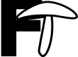

<h1 id="fungtoxins" style="padding-left:70px">FungToxins</h1>

Welcome to FungToxins, a database for fungal toxins. 
FungToxins contains manually annotated experimental data on the toxic action of fungal metabolites and the species that produce them. 
Biosynthetic information of these compounds is provided based on biosynthetic gene clusters in [the MIBiG database](https://mibig.secondarymetabolites.org/){:target="_blank"}. 
FungToxins also collects data from authorities ([EFSA](https://www.efsa.europa.eu/en){:target="_blank"}, [FDA](https://www.fda.gov/){:target="_blank"}) on regulation of mycotoxins in food and information on the carcinogenicity of compounds provided by the [IARC](https://monographs.iarc.who.int/){:target="_blank"}. 
 
You can find an overview of all compounds [here](overview.md). 
 
:warning: This is a work in progress! If you find any mistakes or have suggestions for new things to add, please let me know. 
Contact me at: lisvad@dtu.dk